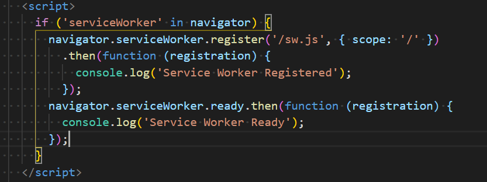
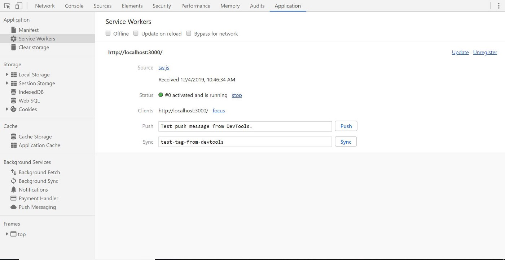
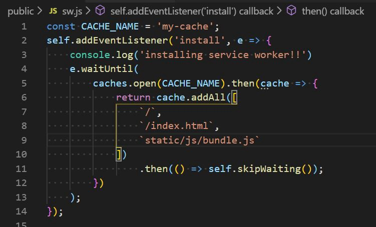
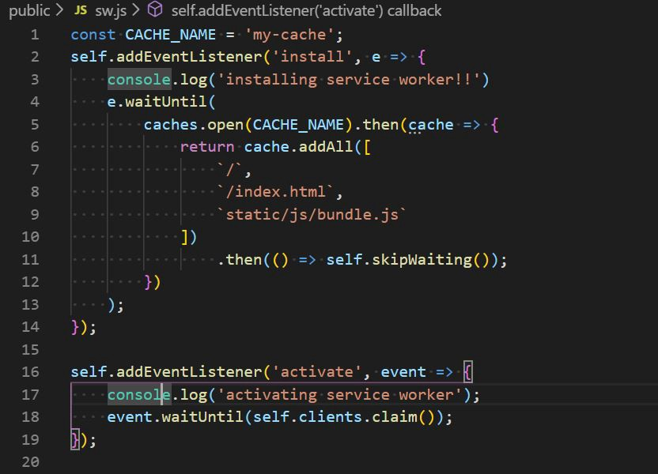
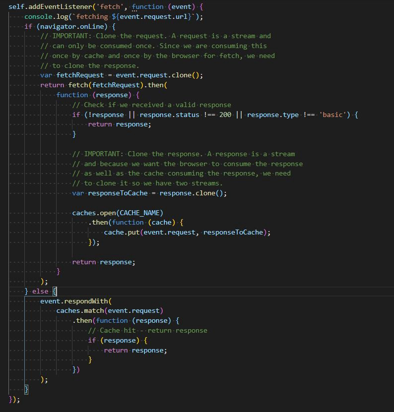

# Service Worker

Service worker are used to build a progressive web app. service workers are what make Progressive Web Apps so amazing.

What is service worker?

A service worker is a script that is run by the browser in the background. It does not interact with the actual app and even the usual user won’t know anything about it. Service worker is a programmable network proxy, allowing you to control how network requests from your page are handled.

Service worker cache the web pages along with other resources, in a separate storage area called CacheStorage.

# The service worker life cycle

A service worker has a lifecycle that is completely separate from your web page. To install a service worker for your site, you need to register it.

These are the following lifecycle of a service worker.

Let’s start with adding a service worker file in your react application.

Step 1. I have created my react application using create-react-app npm package.

Step 2. Create-react-app also gives a service worker file. we are not gonna use that default service-worker file.we will create a new service worker file from scratch.

If you have created your react application using your own configuration then you don’t need to do below step.

If you have create your app using create-react-app then you should delete serviceWorker.js file and remove the following code from index.js.

Step 3. Create a sw.js file in your public folder of root directory and add the following javascript code in index.html file of public folder.

In the above code we are checking serviceWorker in navigator object ( Which is used for browser detection ) and we are registering service worker with the scope of root directory then after registration we are checking service worker is ready or not.Through the above step service worker will get activated and start running but still application will not work offline because we haven’t written any code for caching and fetching any static content in sw.js file.

but if you will check application tab of app. you can see something like this.

Step 4. Now open your sw.js file and add the following code.

**Install event listener**opens the caches object and then populates it with the list of resources that we want to cache. One important thing about the**addAll operation**is that it’s all or nothing. If one of the files is not present or fails to be fetched, the entire addAll operation fails.

we have added a listener during installation event of service worker and we will put the installation event to waiting state to cache our static data( By using**CACHE_NAME**variable you can name caching object in CacheStorage ). Inside the cache.addAll argument we are passing the list of files which we need to cache such as css, html, json and bundled files etc. The successfully return of promise of**addAll**operation we are calling**self.skipWaiting()**which is used to change service worker state from waiting to active.

Step 5 (**Activation Event**): Now we will check that our service worker will get activated or not so add the following code to sw.js.

**Activation Event Listener** will check activating state of service worker.

( you can take control of uncontrolled clients by calling clients.claim() within your service worker once it’s activated [More Explanation](https://stackoverflow.com/questions/41009167/what-is-the-use-of-self-clients-claim) with Example.)

Step 6 (**Fetch Event**): Once a service worker controls a page, it can intercept every request that the page makes and decide what to do with the request. Every request’s response we can match with our storage cache. If response of the request is already available in cache then we can return cached response otherwise we can cache new request’s responses to our cached storage.

I am using **navigator.onLine** to check we are connected to internet or not so I am caching the new response.

If we are using our application offline then it will take from cache storage.

(**navigator.onLine condition** is useful to fetch new static changes of our app).

Now your application is ready to work offline.

This was the boilerplate code implementation of service worker in a react application.

There is a lot to learn about PWA. Please refer the below links.

Happy hacking !

GitHub (sample code) :<https://github.com/imdeepanshugpt/airline/blob/master/public/sw.js>

Resources:<https://developers.google.com/web/fundamentals/primers/service-workers>

Follow me on :

Twitter:<https://twitter.com/imdeepanshugpt>

Linkedin:<https://www.linkedin.com/in/imdeepanshugpt/>

Github:<https://github.com/imdeepanshugpt>